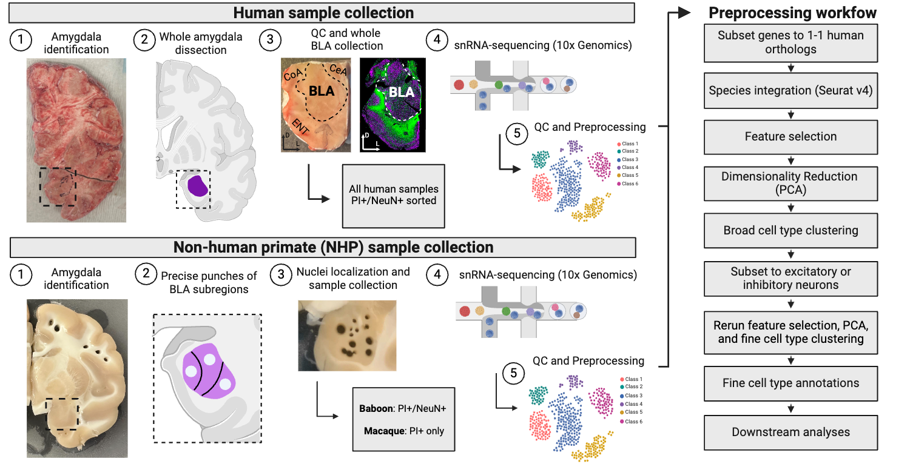

# BLA_crossSpecies

### Study Design
This project, led by Michael Totty, Rita Juanes, and Svitlana Bach, provides an in-depth transcriptomic analysis of amygdala cell types across human and two non-human primate (NHP) species. Using single nucleus RNA sequencing (10x Genomics), the study successfully characterizes the molecular diversity of neuronal cell types found within various subregions of the human and NHP amygdala, including the lateral (LA), basal (BA), accessory basal (aBA), and central nuclei (CeA).

This dataset includes high-quality snRNA-seq data generated from multiple human (n=5) and non-human primate donors (n=x Baboon, n=x Macaque), allowing for cross-species comparisons and the identification of conserved transcriptomic profiles. In total, these data are comprised of XXX, XXX, and XXX neurons from humans, baboons, and macaques, respectively. This dataset serves as a valuable resource for understanding the transcriptional architecture of the amygdala and its implications for psychiatric and neurological diseases.
Both raw and processed data will be made publicly available upon preprint publication, making it a useful resource for future studies into BLA functionality and its role in neuropsychiatric conditions.




### Explore the Data Interactively
We have provided an interective website that allow you to explore all of the data at single nucleus resolution. This is powered by [iSEE](https://bioconductor.org/packages/release/bioc/html/iSEE.html) that allows you to add, hide, customize panels for visualizing the data. The default settings for this app displays the data split by species and/or broad cell type. This can also be combined or split in other way according to the column data. You can create any custom visualizations that you want and download both the code to make them as well as the figures you make. Please check the [iSEE](https://bioconductor.org/packages/release/bioc/html/iSEE.html) documentation for instructions on how to customize the panels.

BLA Shiny App: *Link to iSEE app here*

### Access the data

We will include links to raw and processed data here once available.

### How to Cite
Please cite the peer-reviewed publication when using this data in your research:

**Preprint:**
- **Title:** Transcriptomic Diversity of Basolateral Amygdala Cell Types Across Humans and Non-Human Primates
- **Authors:** Michael S. Totty, Rita Cervara Juanes, Svitlana V. Bach, Lamya Ben Ameur, Madeline Valentine, Evan Simons, McKenna Stocker, Krystal Henderson, Ishbel Del Rosario, Madhavi Tippani, Ryan A. Miller, Joel E. Kleinman, Stephanie Cerceo Page, Arpair Saunders, Thomas M. Hyde, Keri Martinowich, Stephanie C. Hicks, Vincent D. Costa
- **Journal:** bioRxiv (update this with the journal details once available)

Here is the citation information in BibTeX format for convenience:

```bibtex
@article{Totty2024,
    author = {Michael S. Totty and Rita Cervara Juanes and Svitlana V. Bach and Lamya Ben Ameur and Madeline Valentine and Evan Simons and McKenna Stocker and Krystal Henderson and Ishbel Del Rosario and Madhavi Tippani and Ryan A. Miller and Joel E. Kleinman and Stephanie Cerceo Page and Arpair Saunders and Thomas M. Hyde and Keri Martinowich and Stephanie C. Hicks and Vincent D. Costa},
    title = {Transcriptomic Diversity of Basolateral Amygdala Cell Types Across Humans and Non-Human Primates},
    year = {2024},
    journal = {TBD},
    volume = {TBD},
    pages = {TBD},
    doi = {TBD}
}
